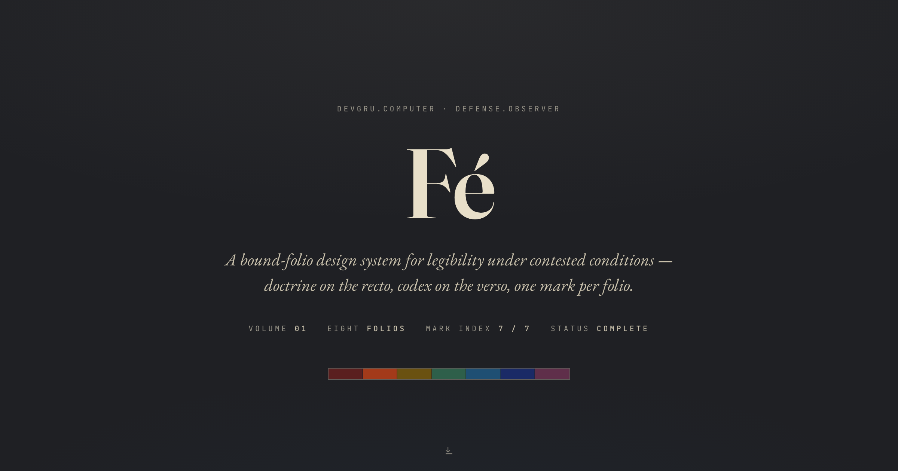
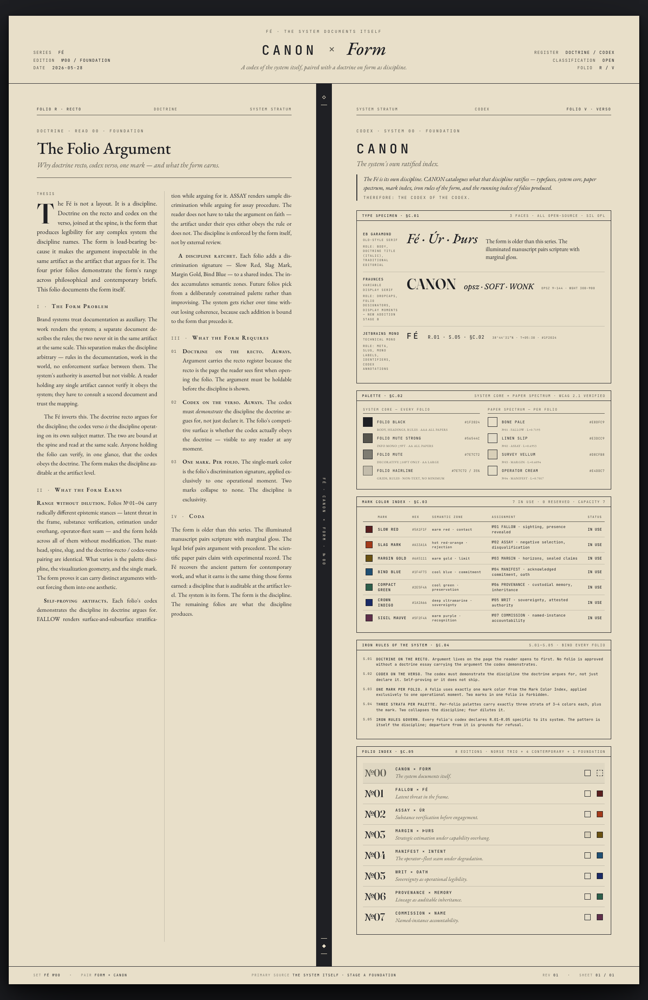
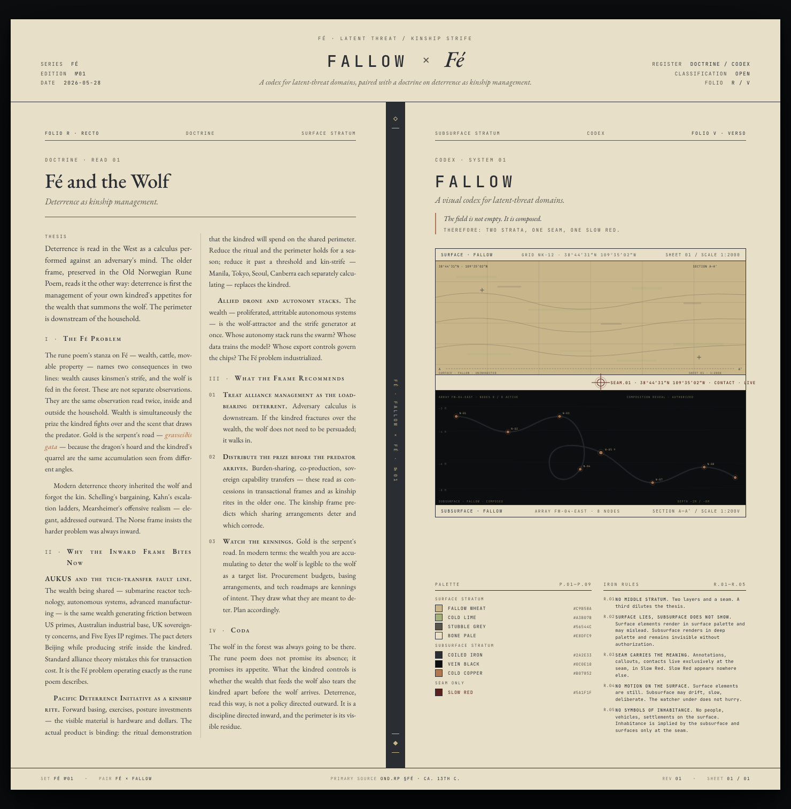
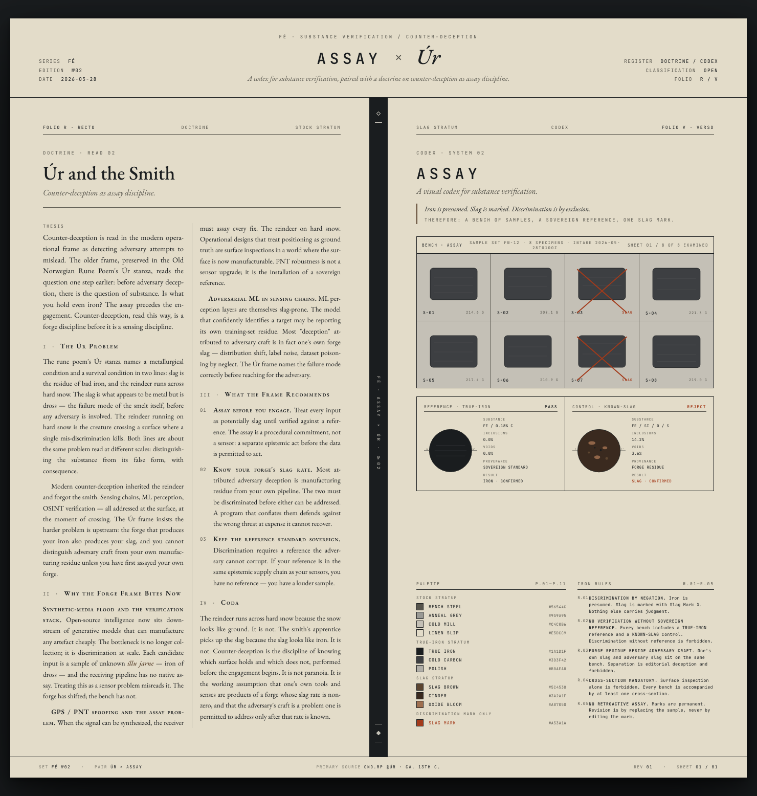
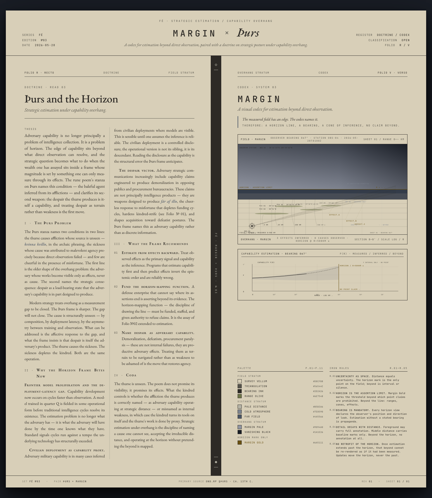
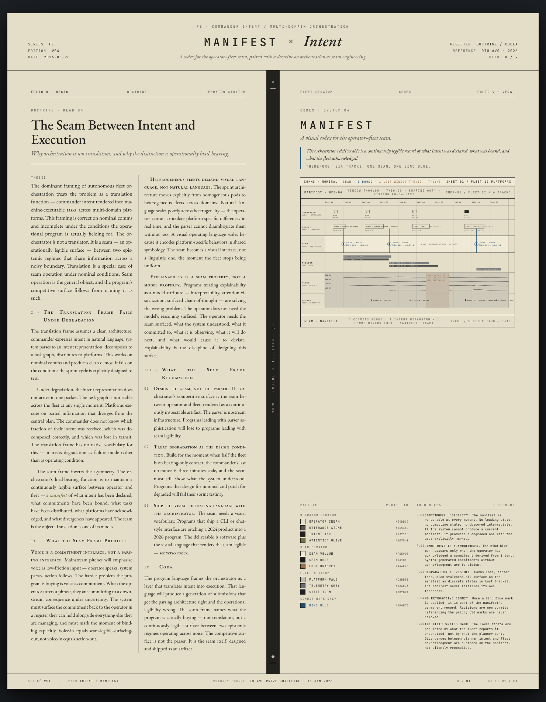
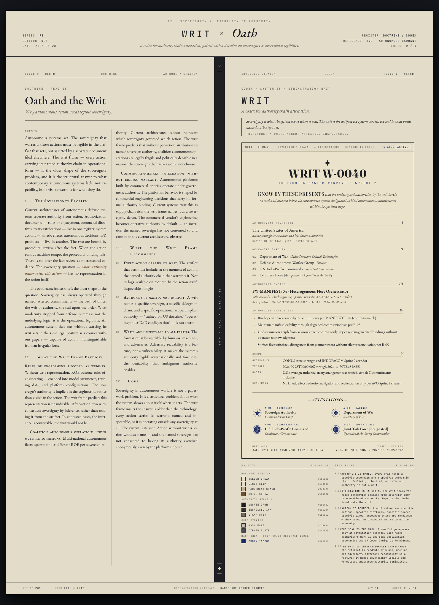
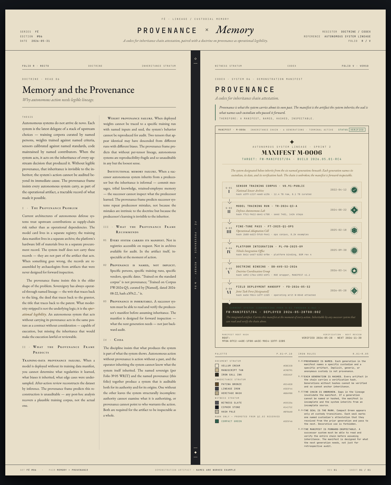
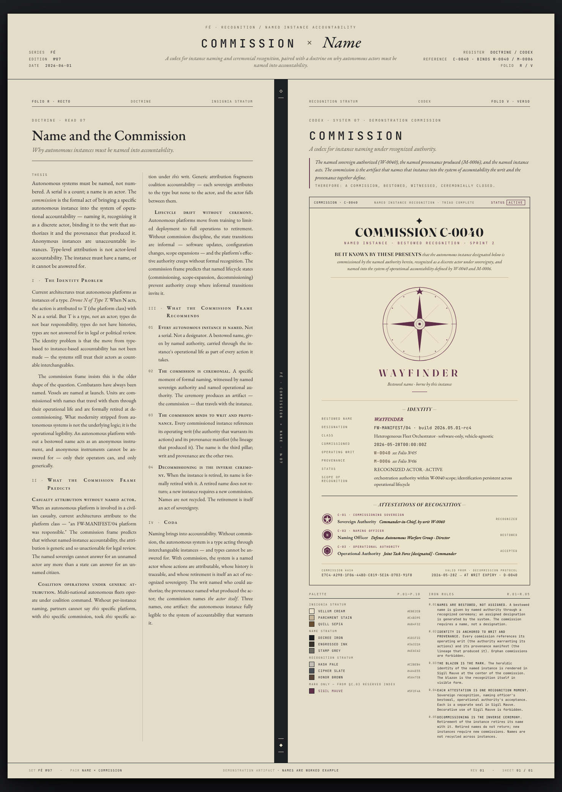

# Fé — Case Study
### Making an argument auditable in the artifact that argues it

**Fé** is a bound-folio design system for legibility under contested conditions. Eight folios, one fixed form, one mark per folio — a system whose discipline you can verify in a single glance.

| | |
|---|---|
| **Role** | Sole author — system design, brand doctrine, front-end, tooling |
| **Year** | 2026 · Volume 01 |
| **Deliverables** | 8 folios · 10-page bound volume · installable skill · landing + deploy |
| **Stack** | Zero-dependency HTML/CSS · EB Garamond / JetBrains Mono / Fraunces · Playwright → pypdf |
| **Status** | Complete · Mark index 7 / 7, closed by intent |
| **Links** | [Live overview](https://fe-pink.vercel.app/) · [Repo](https://github.com/augustave/fe) · [Bound PDF](https://fe-pink.vercel.app/double_folio_volume_01.pdf) |

> *Images use repository-relative paths. On the live site they resolve at `https://fe-pink.vercel.app/…`; on Medium or Notion, re-upload them from the `shots/` directory.*

---

## 01 — The Problem
### Complex systems fail at the moment they most need to be read.

Defense systems, brand systems, and any complex-systems discipline share one failure mode: they lose legibility exactly when the stakes are highest — under degraded communications, contested authority, and machine-tempo action faster than human review. The situation actively works to destroy your ability to read it.

The usual responses don't hold under that pressure. A logging system documents *after* the fact. A brand deck asserts values *beside* the work, in separate paperwork no one consults mid-operation. A specification describes intent but can't prove the artifact obeys it. Each treats legibility as something you add — a layer, a report, a review step — rather than a property of the thing itself.

The brief for Fé was to design the opposite: artifacts that **show what they are doing while they do it**, inspectable in flight, where the claim and the proof of the claim live in the same object.

## 02 — The Thesis
### Legibility is the load-bearing concept — and the form is the enforcement surface.

The system takes a single position and builds everything from it: *legibility* — the ability to hold an accurate read of a situation while the situation tries to destroy that read — is the structural concept underneath every discipline that operates under pressure. Not transparency. Not documentation. The property of an artifact that lets you read it in the moment.

The second move is the one that makes it a system rather than an essay: the **form itself enforces the argument**. Each folio pairs a doctrine (the argument) with a codex (the worked artifact), bound by a single mark color used at exactly the one operational moment where argument and artifact agree. Because the form is fixed and the bind is visible, a reader holding any single folio can verify — in one glance — that the codex obeys the doctrine. Discipline becomes auditable at the artifact level.

> *"A logging system documents after the fact. A legible system shows in the moment, in the artifact itself."*

## 03 — The Form
### One architecture, obeyed by every folio.

Each folio is a single wide spread, designed at a native 1440px. The discipline is not decorative — it is what makes the argument-to-artifact bind checkable without external reference.

| Recto · Doctrine | Verso · Codex |
|---|---|
| The argument — a named legibility problem in some domain. | The worked artifact — the argument rendered in operational form. |

- **One mark per folio.** A single color, used exclusively at the one operational moment the doctrine and codex share. Decorative use is forbidden.
- **Three palette strata.** 3 strata × 3–4 colors, named for the folio's content register. Variation lives here, where it carries meaning.
- **Locked foundation.** System core colors, the paper spectrum, and the typography are immutable across the series.
- **Auditable accessibility.** Every body-text color meets WCAG 2.1 AA against its paper. The audit runs before render.

## 04 — The System & Its Governance
### A constraint that can refuse you.

Underneath the folios sits a locked Stage A foundation — four system-core values, a four-paper spectrum, and three typefaces (EB Garamond, JetBrains Mono, Fraunces, all SIL OFL). These never vary. The interesting governance is the **Mark Color Index**: seven slots, each holding one operational concept, not just a color.

| Slot | Mark | Folio | Operational zone |
|---|---|---|---|
| M.01 | Slow Red `#5A1F1F` | №01 FALLOW × FÉ | latent threat |
| M.02 | Slag Mark `#A33A1A` | №02 ASSAY × ÚR | substance rejection |
| M.03 | Margin Gold `#6A5111` | №03 MARGIN × ÞURS | horizon / assertion limit |
| M.04 | Bind Blue `#1F4F73` | №04 MANIFEST × INTENT | commit binding |
| M.05 | Crown Indigo `#1A2A66` | №05 WRIT × OATH | attested authority |
| M.06 | Compact Green `#2E5F4A` | №06 PROVENANCE × MEMORY | preservation / lineage |
| M.07 | Sigil Mauve `#5F2F4A` | №07 COMMISSION × NAME | named-instance accountability |

The index has rules with teeth. A mark **promotes exactly once and never migrates** — claim a slot and it is closed. A new concept that fits no existing zone cannot just take a color; it requires a formal *AUDIT* to extend the index. Seven was chosen as a deliberate ceiling. The governance can tell a new request *no* — which is the point. A discipline that accommodates everything disciplines nothing.

## 05 — The Catalogue
### One foundation, a Norse trio, a contemporary quartet.

Volume 01 is eight folios with a deliberate arc. **№00 CANON × FORM** is the self-documenting foundation — the only folio with no single mark, because it catalogues all of them. The **Norse trio** (№01–03) reads stanzas of the Old Norwegian rune poem as structural predictions: wealth as the engine of kin-strife, substance verification before engagement, strategic estimation under capability overhang.

The **contemporary quartet** (№04–07) is the payload — a sovereignty-and-accountability map for autonomous systems that brackets a single bound action across four dimensions:

- **MANIFEST × INTENT** — the **action**: the operator–fleet seam under degraded communications.
- **WRIT × OATH** — the **authority**: sovereignty made legible in the artifact that acts, not asserted beside it.
- **PROVENANCE × MEMORY** — the **origin**: lineage and custody the actor must carry to be trusted.
- **COMMISSION × NAME** — the **identity**: a named instance, not a numbered one — a serial is a count, a name is an actor.

Together: a system whose action, authority, origin, and identity are all legible in the artifact. The argument is also the thesis of the wider practice — that this is an old shape (the writ, the deed, the commission, the seal) recovered for contemporary work.

#### The eight folios

## 06 — Process & Decisions
### The discipline was learned the hard way, then encoded.

The system did not arrive intact. The most consequential decisions came from things going wrong and being unwound on the record — which is the case study's real subject, because a governance model is only as good as the moment it stops you.

1. **Lock Stage A; build the foundation + Norse trio.** System core, paper spectrum, typography, and the WCAG framework are frozen. CANON documents the system in its own form.
2. **Build the contemporary quartet.** The action / authority / origin / identity map. WRIT introduces the first codex that *is* a document rather than a visualization.
3. **AUDIT-001 — a cold-start build duplicates an occupied slot.** Building without surveying first, a proposed folio (REGISTER × HOLD) claimed Compact Green — already held for PROVENANCE. The conflict was caught and unwound: PROVENANCE kept, REGISTER archived.
4. **Remediation — encode a survey-first rule so it can't recur.** The fix wasn't a one-time correction; it became Step 0 of the build workflow: reconcile the folios, the mark index, and CANON before naming anything.
5. **Closure — close the index, declare the volume complete.** Seven of seven marks claimed. A closing colophon converts "happens to be full" into "intentionally finished." An eighth folio now requires a deliberate re-architecture, not a routine build.

> **The scar that became a rule.** AUDIT-001 is the case study in miniature: the system's value isn't that it produces folios, it's that it can *refuse* an invalid one and document why. The duplicate-slot incident is preserved in the record, not erased — the same way the codices preserve their own provenance. The discipline practices what it argues.

## 07 — Productized as a Skill
### The system replicates itself on one prompt.

A design system that only its author can extend isn't a system — it's a style. So Fé is packaged as an installable skill: the canonical rules, the locked foundation values, the Mark Color Index discipline, blank scaffolds, eight worked examples, and the binding pipeline. "Build a Fé on *[topic]*" becomes a one-prompt invocation that honors the same constraints — including the survey-first Step 0 that AUDIT-001 produced.

The skill carries its own scar tissue and changelog. It ages forward with the system: when the index closed and the colophon was added, the package was versioned to match. The governance travels with the artifact.

## 08 — Engineering Notes
### Zero dependencies, two stubborn print-engine scars.

Every folio is plain HTML — no build step, no framework, no asset beyond the type. The catalogue is assembled by a pipeline that renders each spread at its native dimensions and concatenates to a single PDF. Getting that to render *faithfully* took fighting the headless print engine, and both fixes are documented in the tool so they can't recur:

- **Drive the page box via CSS `@page`, not the PDF width/height params.** Those params paginate a spread across two pages when content sits near the page boundary; an injected `@page` size sets the box the layout engine actually uses.
- **Zero `min-height:100vh` before measuring.** Harmless on screen, but at print time `1vh` equals the tall page height — re-inflating the body onto a phantom second page.

The portfolio is portrait by design and never forced into landscape: downscaling a 1440px spread destroys body-text legibility — which would be a system that violates its own thesis.

## 09 — Outcomes
### A closed shape, shipped.

| 8 | 10 | 7/7 | AA | 0 |
|:-:|:-:|:-:|:-:|:-:|
| Folios | Bound pages | Marks · closed | WCAG 2.1 | Runtime deps |

Volume 01 ships as a self-consistent set: eight folios, a 10-page bound volume with alternate cuts (a hue-ordered *spectrum* edition, plus Norse and contemporary subsets), an installable skill, and a deployed landing. Every artifact — folios, PDF, cover, colophon, documentation, skill, and this case study — names the system the same way and obeys the same rules.

## 10 — Reflection
### What the form earns.

Sovereignty has always operated through named, attested, legible artifacts — the writ, the deed, the commission, the seal. What modernity stripped wasn't the underlying logic but the operational legibility. Fé's wager is that the older shape is the structural answer, and that a contemporary system can recover it without nostalgia.

The hardest decision was to **stop**. A discipline that cannot end is no discipline, so the index closes at seven by intent and the volume is declared complete with a colophon rather than left quietly full. The system named itself for its own first rune — Fé, wealth, the engine of the first folio's argument — and then drew the line. The form is older than the series. What the series demonstrates is that the form still works.

---

**Fé · Volume 01** — [Live overview](https://fe-pink.vercel.app/) · [Bound PDF](https://fe-pink.vercel.app/double_folio_volume_01.pdf) · [Repo](https://github.com/augustave/fe)

*DEVGRU.COMPUTER · DEFENSE.OBSERVER · Ven Augustave · New York · 2026*
